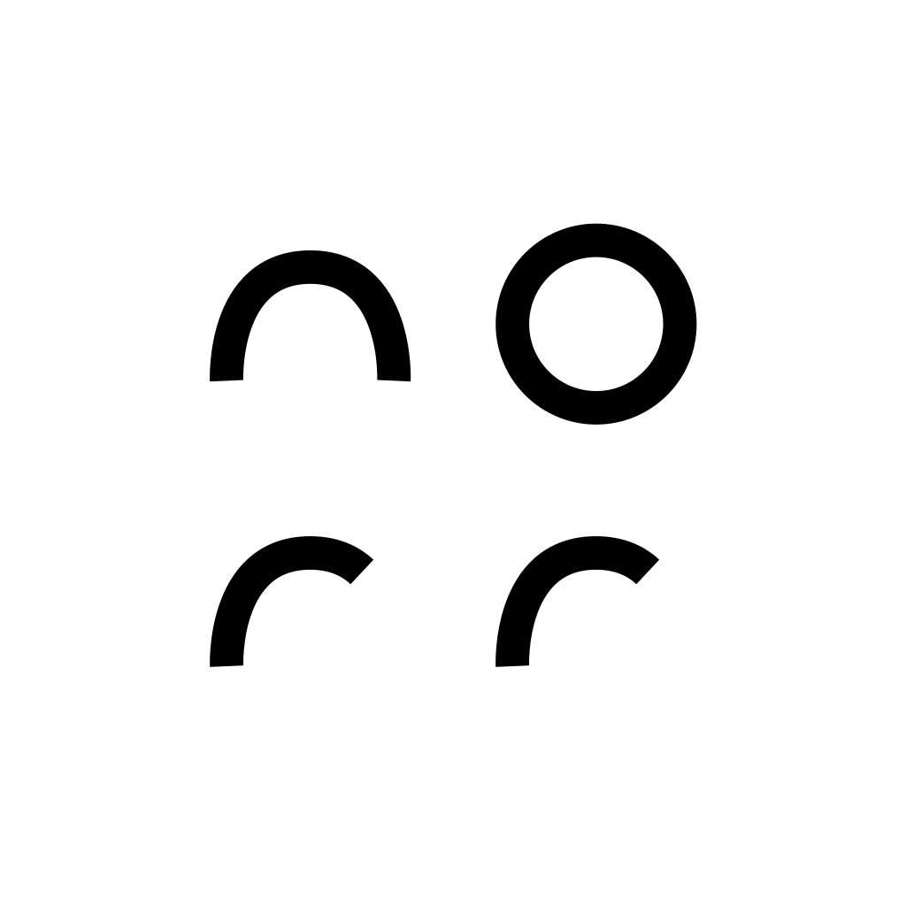

# Norr

#### macOS is pasteboard manager for users who want to work more efficiently and stay organized.

## How to use

- For quick access to the application use global shortcut <kbd>CTRL (⌃)</kbd> + <kbd>COMMAND (⌘)</kbd> + <kbd>C</kbd>
- To open the application you can use menu bar icon and click `Open App`
- The application shows pasteboard history. To copy item from the history - select necessary pasteboard item and click <kbd>Return (↩)</kbd>.
- To delete item from the history - select necessary pasteboard element and click <kbd>Delete (⌦)</kbd>
- From the application settings is possible to change global shortcut for the application, add application exclusions in case user would not like to retain pasteboard history when application is active (for example Keychain, 1Password, etc.).

## Motivation

I wanted to create an app to boost my productivity and add a touch of smoothness and fun to my daily tasks. Deciding to start with optimizing the pasteboard seemed like a great beginning.

## License

[MIT](./LICENSE)